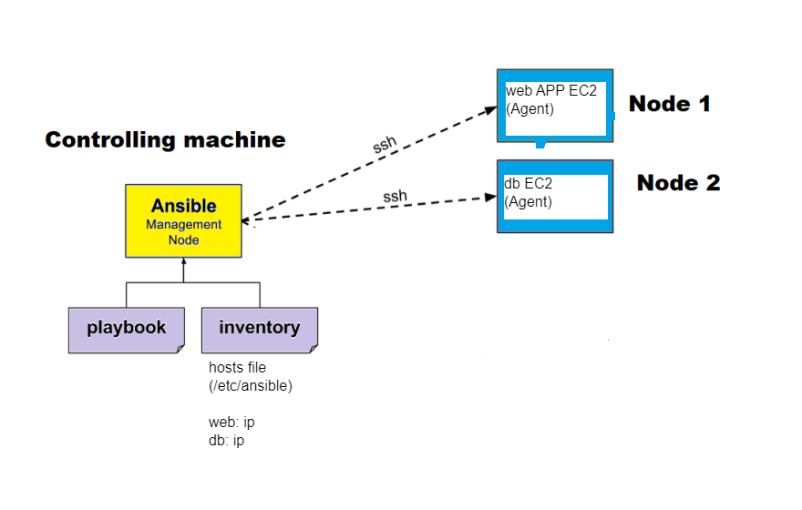
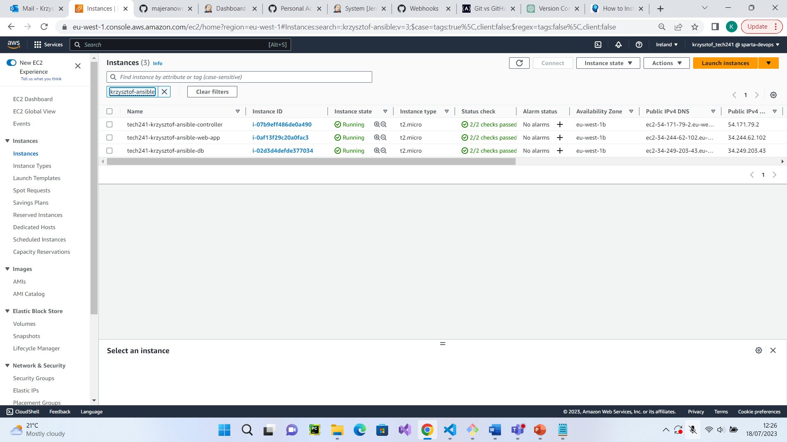
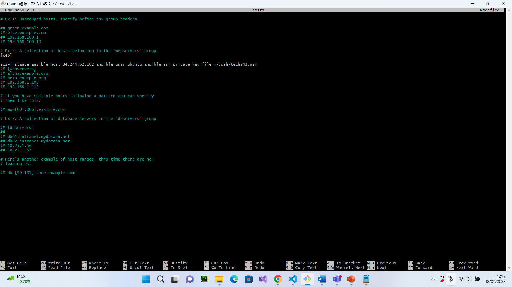
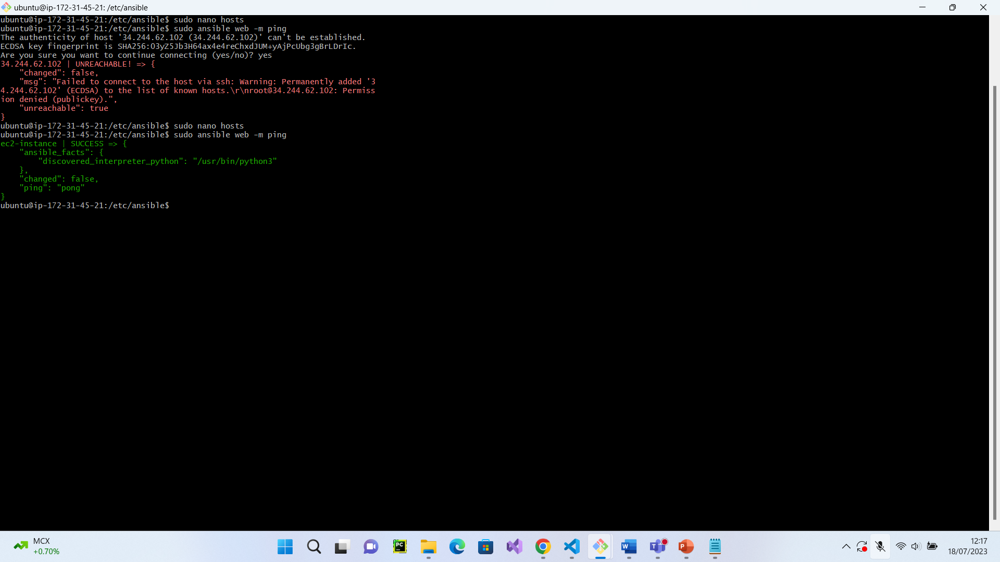
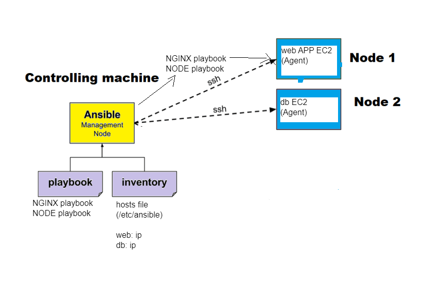
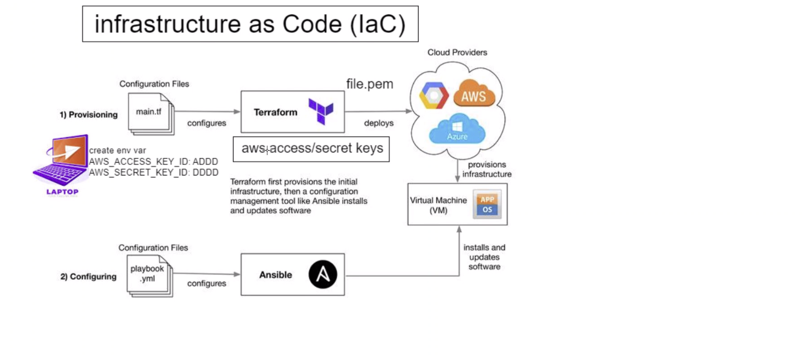

# Infrastructure as Code (IaC)

IaC stands for Infrastructure as Code. It is an approach to managing and provisioning infrastructure resources using machine-readable configuration files or scripts rather than manual processes.

Traditionally, when setting up and managing infrastructure, such as servers, networks, and storage, it would involve manual configuration and management through a series of manual steps or scripts. This manual approach can be time-consuming, error-prone, and difficult to reproduce consistently.

With Infrastructure as Code, infrastructure resources are defined, configured, and managed using code. This code is typically written in a domain-specific language (DSL) or a general-purpose programming language, such as YAML, JSON, or even programming languages like Python or Ruby.

# Ansible

What is it?

A configuration manager tool used in DevOps. It is simple. It is agent-less. No dependencies needed for it to run. Lightweight.

Ansible is an open-source automation tool that provides a simple, agentless, and powerful platform for managing and automating IT infrastructure and configuration management tasks. It is designed to streamline and simplify the process of deploying, configuring, and orchestrating systems and applications.

ansible default folder - to make changes in configuration file

cd /etc/ansible/

# Ansible Architecture




* Step 1: Let's start with creating EC2 instances on AWS. 1 for ansible controller and 2nd and 3rd for agend nodes for app and db.
   - All Of them should have SSH security group rules and Ubuntu 18.04 (because it has python already preinstalled (the only dependencies for Ansible))



* Step 2: SSH in manually to Node Controller and install ansible:
  - Run update and upgrade commands:

```bash
sudo apt update -y
sudo apt upgrade -y
``` 

* Step 3: Install Ansible

```bash
 sudo apt-add-repository ppa:ansible/ansible
 sudo apt install ansible -y
 sudo apt update -y
```

* Step 4: go back to controller VM and create a .pem file in ~/.ssh/ folder called tech241.

* Step 5: Manually SSH in to app and db VMs (agent nodes) from our controller VM and run update and upgrade commands to make agents available to connect

```bash
sudo apt update -y
sudo apt upgrade -y
``` 


* Step 6: Go to default directory for ansible to configure hosts file that wil allow connection between controller and agents

```bash
cd /etc/ansible/

sudo nano hosts

```

  - In the file add app and db VMs

```bash
# Ex 2: A collection of hosts belonging to the 'webservers' group
[web]

ec2-instance ansible_host=34.244.62.102 ansible_user=ubuntu ansible_ssh_private_key_file=~/.ssh/tech241.pem

[db]

ec2-instance ansible_host=34.249.203.43 ansible_user=ubuntu ansible_ssh_private_key_file=~/.ssh/tech241.pem

```



* Step 7: Test the connection between controller and agents.

```bash
sudo ansible web -m ping
sudo ansible db -m ping

```



SUCCESS!

# adhock commands

Ad-hoc commands in the context of Ansible refer to one-line commands that you can run from the command line without the need for writing a separate Ansible playbook or script. These commands allow you to perform quick tasks or execute specific modules on remote servers.

We don't need to ssh manually to each system. keeping process system. 

we need sudo permission

-a - argument of what command we should run on agent

`sudo ansible web -a "uname -a"` - checking os version on agent node

`sudo ansible web -a "date"` - checking time zone on agent node.

`sudo ansible web -a "free"` - checking free space on agent node

`sudo ansible web -a "ls -a"` - checking what is installed on agent

`sudo ansible web -m ansible.builtin.copy -a "src=/etc/ansible/test.txt dest=~"` - copy a test.txt file from controller node to agend home folder. on controller file was in ansible folder.

## Scripting in Ansible



Web-node:
install nginx
node security group must allow port 80

Playbooks - scripts

need to be in default location /etc/ansible

`sudo nano nginx.yml` - to create YAML script file

```YAML
# YAML file start with --- thre dashes
# Why playbooks
# Create a playbook to install nginx in web node
---

# Which host to perform the task
- hosts: web

# see the logs by gathering facts
  gather_facts: yes
# admin access (sudo)
  become: true
# add the instructions  -  install nginx on web agent
  tasks:
  - name: Installing nginx
    apt: pkg=nginx state=present
# check the status of nginx - ensure is actively running

# adhoc command to check the status


```

`sudo ansible-playbook nginx.yml`

RESPONSE:

```bash
PLAY [web] *********************************************************************

TASK [Gathering Facts] *********************************************************
ok: [ec2-instance]

TASK [Installing nginx] ********************************************************
changed: [ec2-instance]

PLAY RECAP *********************************************************************
ec2-instance               : ok=2    changed=1    unreachable=0    failed=0    skipped=0    rescued=0    ignored=0

```

HOSTS FILE:

```bash
# This is the default ansible 'hosts' file.
#
# It should live in /etc/ansible/hosts
#
#   - Comments begin with the '#' character
#   - Blank lines are ignored
#   - Groups of hosts are delimited by [header] elements
#   - You can enter hostnames or ip addresses
#   - A hostname/ip can be a member of multiple groups

# Ex 1: Ungrouped hosts, specify before any group headers.

## green.example.com
## blue.example.com
## 192.168.100.1
## 192.168.100.10

# Ex 2: A collection of hosts belonging to the 'webservers' group

[web]

web-instance ansible_host=34.242.248.77 ansible_user=ubuntu ansible_ssh_private_key_file=~/.ssh/tech241.pem

[db]

db-instance ansible_host=54.246.248.58 ansible_user=ubuntu ansible_ssh_private_key_file=~/.ssh/tech241.pem


## [webservers]
## alpha.example.org
## beta.example.org
## 192.168.1.110

```

NODE and PM2 Playbook:

* Make sure to add port 3000 on app instance


```bash
---

# Which host to perform the task
- hosts: web

# see the logs by gathering facts
  gather_facts: yes
# admin access (sudo)
  become: true
# add the instructions  -  install node 12 with pm2 and run the app
  tasks:
  - name: Installing node v 12the gog key for nodejs
    apt_key:
      url: "https://deb.nodesource.com/gpgkey/nodesource.gpg.key"
      state: present

  - name: Add NodeSource repository
    apt_repository:
      repo: "deb https://deb.nodesource.com/node_12.x {{ ansible_distribution_release }} main"
      state: present

  - name: Install Node.js
    apt:
      name: nodejs
      state: present
      update_cache: yes

  - name: Install PM2
    npm:
      name: pm2
      global: yes
      state: present

  - name: Install app dependencies
    command: npm install
    args:
      chdir: "app"

  - name: Stop PM2 processes
    shell: pm2 kill

  - name: Start the Node.js app
    command: pm2 start app.js
    args:
      chdir: "app/"


```

NGINX and Reverse Proxy playbook:

```bash
# YAML file start with --- thre dashes
# Why playbooks
# Create a playbook to install nginx in web node
---

# Which host to perform the task
- hosts: web

# see the logs by gathering facts
  gather_facts: yes
# admin access (sudo)
  become: true
# add the instructions  -  install nginx on web agent
  tasks:
  - name: Installing nginx
    apt: pkg=nginx state=present
# check the status of nginx - ensure is actively running

# configure reverse proxy (change the line in default config file )

  - name: Customize Nginx default configuration file
    lineinfile:
      path: /etc/nginx/sites-available/default
      regexp: '^(\s*try_files.*)$'
      line: '        proxy_pass http://localhost:3000;'

# restart nginx

  - name: Restart Nginx service
    service:
      name: nginx
      state: restarted

```

MONGODB Playbook

```bash
---

- hosts: db

  gather_facts: yes

  become: true

  tasks:

  - name: Installing Mongodb
    apt: pkg=mongodb state=present

  - name: Modify mongod.conf to change bindIp
    lineinfile:
      path: /etc/mongodb.conf
      regexp: '^bind_ip'
      line: 'bind_ip = 0.0.0.0'

  - name: Restart Mongodb
    service:
      name: mongodb
      state: restarted

  - name: starting and enabling Mongodb
    service:
      name: mongodb
      state: started
      enabled: yes


```

In the App VM I have created ENV Variable with DB host:

```bash
sudo nano /etc/environment
DB_HOST=mongodb://<IP ADDRESS>:27017/posts
```

# Combining the scripts into 1:

```bash

---
- import_playbook: mongodb-playbook.yml
- import_playbook: nginx-playbook.yml

# Which host to perform the task
- hosts: web

# see the logs by gathering facts
  gather_facts: yes
# admin access (sudo)
  become: true
# add the instructions  -  install node 12 with pm2 and run the app
  tasks:
  - name: Installing node v 12the gog key for nodejs
    apt_key:
      url: "https://deb.nodesource.com/gpgkey/nodesource.gpg.key"
      state: present

  - name: Add NodeSource repository
    apt_repository:
      repo: "deb https://deb.nodesource.com/node_12.x {{ ansible_distribution_release }} main"
      state: present

  - name: Install Node.js
    apt:
      name: nodejs
      state: present
      update_cache: yes

  - name: Install PM2
    npm:
      name: pm2
      global: yes
      state: present

  - name: Install app dependencies
    command: npm install
    args:
      chdir: "app"

  - name: Stop PM2 processes
    shell: pm2 kill

  - name: Start the Node.js app
    command: pm2 start app.js
    args:
      chdir: "app/"

```

MONGODB-PLAYBOOK.YML

```bash
---

- hosts: db

  gather_facts: yes

  become: true

  tasks:

  - name: Installing Mongodb
    apt: pkg=mongodb state=present

  - name: Modify mongod.conf to change bindIp
    lineinfile:
      path: /etc/mongodb.conf
      regexp: '^bind_ip'
      line: 'bind_ip = 0.0.0.0'

  - name: Restart Mongodb
    service:
      name: mongodb
      state: restarted

  - name: starting and enabling Mongodb
    service:
      name: mongodb
      state: started
      enabled: yes

```

NGINX-PLAYBOOK.YML

```bash

# YAML file start with --- thre dashes
# Why playbooks
# Create a playbook to install nginx in web node
---

# Which host to perform the task
- hosts: web

# see the logs by gathering facts
  gather_facts: yes
# admin access (sudo)
  become: true
# add the instructions  -  install nginx on web agent
  tasks:
  - name: Installing nginx
    apt: pkg=nginx state=present
# check the status of nginx - ensure is actively running

  #- name: Remove nginx conf file (delete file)
   # file:
  #    path: /etc/nginx/sites-available/default
 #     state: absent

#  - name: Copy file from controller to agent node
#    copy:
#      src: /etc/ansible/default
#      dest: /etc/nginx/sites-available/

# configure reverse proxy (change the line in default config file )


  - name: Customize Nginx default configuration file
    lineinfile:
      path: /etc/nginx/sites-available/default
      regexp: 'try_files $uri $uri/ =404;'
      line: '        proxy_pass http://localhost:3000;'
      state: present
      backrefs: yes

  - name: Restart nginx
    service:
      name: nginx
      state: restarted

```

# Terraform

## What is Terraform

Terraform is an open-source infrastructure as code (IaC) tool developed by HashiCorp. It allows users to define and manage their cloud infrastructure using a declarative and version-controlled approach. With Terraform, you can create, modify, and delete cloud resources across various cloud providers, such as Amazon Web Services (AWS), Microsoft Azure, Google Cloud Platform (GCP), and others.

Using a simple, human-readable configuration language, often referred to as "HCL" (HashiCorp Configuration Language), users can describe the desired state of their infrastructure. Terraform then takes these configuration files and automatically translates them into API calls to the respective cloud provider, building and managing the specified resources accordingly.

## Why use terrarofm?

The best part is that Terraform is like magic; it works with different cloud providers like Amazon Web Services, Microsoft Azure, or Google Cloud. So you can build your cloud structures in the same way, no matter which cloud provider you choose.

With Terraform, you have better control, consistency, and scalability of your cloud infrastructure. It saves you time, reduces errors, and helps you manage your cloud resources more effectively. So you can focus on your projects and let Terraform handle the heavy lifting of building and managing your cloud world.

## Benefits

* **Easy Infrastructure Setup:** Terraform allows you to create and set up your cloud resources in a simple and straightforward way. It's like giving instructions to a magic tool that builds everything you need for your website or application in the cloud.

* **Works with Different Clouds:** Whether you choose Amazon Web Services, Microsoft Azure, Google Cloud, or other cloud providers, Terraform can handle them all. You don't need to learn different tools for each cloud - Terraform can work with them all, making your life easier.

* **Consistency and Reproducibility:** Terraform ensures that your cloud infrastructure is the same every time you set it up. It follows your instructions precisely, which means you won't have any surprises or unexpected differences between your development, testing, and production environments.

* **Saves Time and Reduces Errors:** By using Terraform, you can save a lot of time because it automatically sets up your infrastructure based on your instructions. Plus, it reduces mistakes that might happen if you were doing things manually.

* **Manage Infrastructure Changes:** As your needs change, you can modify your instructions to add or remove resources easily. Terraform will then make the necessary adjustments in your cloud infrastructure without any hassle.

* **Team Collaboration:** Terraform allows multiple people to work together on building and managing the cloud infrastructure. It's like everyone is playing with the same set of building blocks and creating the same structures without stepping on each other's toes.

## Who uses Terraform

* **DevOps and Cloud Engineers:** DevOps engineers and cloud engineers are among the primary users of Terraform. They use it to automate the provisioning and management of cloud infrastructure.

* **System Administrators:** System administrators utilize Terraform to simplify the process of deploying and maintaining infrastructure in the cloud. It helps them manage resources efficiently and reduce manual tasks.

* **Developers:** Developers often use Terraform to define and set up the required infrastructure for their applications automatically. This ensures that the necessary resources are available for the application to run.

### Companies:

* **Hashicorp** - creators of Terraform

* **Netflix** 

* **Adobe**

* **GitHub** 

## Installation of terraform

* Step 1: Download Terraform: Go to the official Terraform website and download the Windows 64-bit version of Terraform. The website URL is: https://www.terraform.io/downloads.html

* Step 2: Extract the Downloaded ZIP: After the download is complete, extract the contents of the ZIP file to a location on your computer. You can use the built-in ZIP extractor in Windows or any third-party extraction tool like 7-Zip.

* Step 3:Add Terraform to PATH: To use Terraform from any directory in the Command Prompt, you can add the Terraform executable to your system's PATH environment variable. This step is optional but can make it more convenient to use Terraform.

  - Open the Start menu and search for "Environment Variables."
  - Click on "Edit the system environment variables."
  - Click the "Environment Variables" button at the bottom.
  - In the System Variables section, find the "Path" variable and click "Edit."
  - Click "New" and add the path to the directory where the Terraform executable (terraform.exe) is located. For example, if you extracted the ZIP to C:\terraform, add C:\terraform to the Path.
  - Click "OK" to save the changes.

* Step 4: Verify Installation: Open a new Command Prompt or PowerShell window and run the following command to check if Terraform is installed and accessible:

```
terraform version
```



